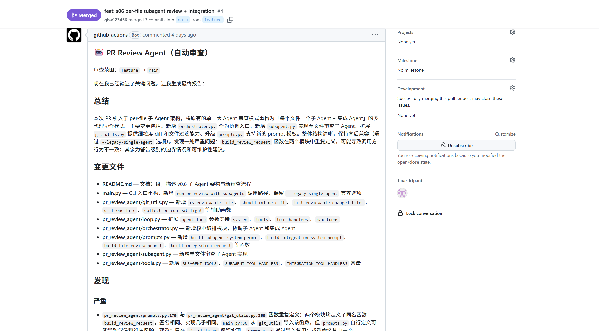
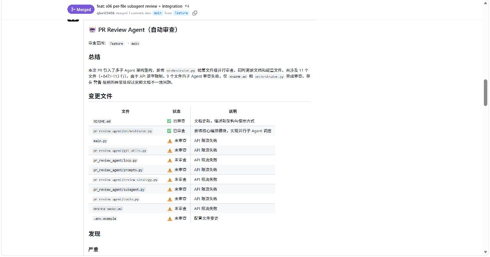

# PR Review Agent

基于 [learn-claude-code](https://github.com/anthropics/learn-claude-code) **s01 Agent Loop + s02 Tool Use + s03 Permission + s06 Subagent** 的 PR 代码审查 Agent。

## 效果演示

PR 打开或更新时，GitHub Actions 运行 `python main.py review`，在 PR 上更新一条 **🤖 PR Review Agent（自动审查）** 评论（`feature` → `main`）。

**完整审查示例**（子 Agent 分文件 + 主 Agent 集成）：



**API 限流时的表现**（并行子 Agent 易触发提供商 RPM/TPM；已支持 `REVIEW_API_*` 退避重试，可调低 `REVIEW_SUBAGENT_WORKERS`）：



## 当前能力（v0.8）

| 模块 | 对应章节 | 说明 |
|------|----------|------|
| `pr_review_agent/loop.py` | s01 | 多轮 tool loop（可注入不同 tools/system） |
| `pr_review_agent/tools.py` | s02 | bash / read_file / write_file / edit_file / glob |
| `pr_review_agent/permissions.py` | s03 | 三道闸门：硬拒绝 / 规则匹配 / 用户确认 |
| `pr_review_agent/git_utils.py` | s08 思路 | 按文件分块 inline diff；轻量上下文给集成阶段 |
| `pr_review_agent/subagent.py` | s06 | **每变更文件**独立子 Agent：全文 + diff + 最多 2 个关联文件 |
| `pr_review_agent/orchestrator.py` | s06 | **并行**子 Agent（默认 4 workers）→ 主 Agent 集成 |
| `pr_review_agent/prompts.py` | — | 子 Agent / 集成 / 旧版单 Agent 提示词 |
| `.github/workflows/pr-review.yml` | CI | PR 更新时自动 review 并评论 |

### 审查流程（默认 `review --mode auto`）

```text
auto 分流（须同时满足才走 legacy）：
  · 可审查文件数 ≤ 6（REVIEW_LEGACY_MAX_FILES 可调）
  · 每个文件的 git diff ≤ 8KB（与首条 inline PER_FILE_MAX 一致）
  否则 → 子 Agent 分文件 + 主 Agent 集成
  legacy：首条 inline diff 分块 8KB/100KB，一条对话审完

大 PR（subagent）路径：
1. 列出可审查的变更文件（.py / .ts / .yaml …，跳过 lock/二进制）
2. 每个文件 → 子 Agent（独立 messages，**ThreadPool 并行**，默认 4 workers）
3. 主 Agent 合并摘要 + 跨文件风险 → 最终报告
```

### 可靠性

- **空 diff**：无变更时跳过 LLM
- **auto 分流**：小 PR 且单文件 diff 不大 → legacy；文件多或单文件 diff 过大 → subagent
- **超 50 个可审查文件**（subagent）：只审前 50，其余在报告中提示人工复查
- **手动覆盖**：`--mode legacy` / `--mode subagent`（`--legacy-single-agent` 等同 legacy）
- **API 限流重试**：`agent_loop` 对 `messages.create` 自动退避重试（见 `REVIEW_API_*` 环境变量）
- **usage 统计**：审查结束打印每阶段 calls/tokens/耗时（`REVIEW_LOG_USAGE`，子 Agent 并行完成行也会带简要数据）
- **团队规则**：`review-rules.yaml` 注入 system prompt（正向 rules + 负向 negative_examples，来自人工反馈沉淀）
- **增量审查**：PR 更新时仅 LLM 审查 `since_sha..HEAD` 新增 diff，并与上次 PR 评论合并（评论内 `<!-- pr-review-agent:last_sha=... -->` 标记）

### s03 权限行为

| 模式 | 行为 |
|------|------|
| `review` | 禁止 `write_file`/`edit_file`；危险 `bash` 自动拒绝 |
| `chat` | 输入 `review` 走与子 Agent 相同的分文件流程 |
| `chat` 其它 | 交互式单 Agent，可写文件（需确认） |

## 开发自测

**管道单元测试**（路由 / 分块，不调用大模型）：

```bash
pip install -r requirements.txt -r requirements-dev.txt
pytest -q
```

**Golden PR 评测**（含 bug 的 fixture；pytest 只测 git 构建与打分器，不调 LLM）：

```bash
pytest tests/test_golden_fixtures.py -q
```

真实审查质量评测（需 `.env`）：

```bash
python scripts/run_golden_eval.py --all
```

见 [tests/golden/README.md](tests/golden/README.md)。

## 快速开始

```bash
cd pr-review-agent
pip install -r requirements.txt
copy .env.example .env   # 填入 ANTHROPIC_API_KEY 和 MODEL_ID
```

在 **Git 仓库根目录** 下运行：

```bash
# 默认 auto：≤6 文件且单文件 diff ≤8KB → legacy，否则 subagent
python main.py review

python main.py review --base develop --output REVIEW.md

python main.py review --mode subagent    # 强制分文件子 Agent
python main.py review --workers 8       # 并行子 Agent（仅 subagent 路径）
python main.py review --workers 1       # 串行子 Agent（保留逐文件工具日志）
python main.py review --mode legacy      # 强制单 Agent + diff 分块
python main.py review --legacy-single-agent   # 同上（兼容旧参数）

python main.py chat   # 输入 review 走 auto 分流
```

## GitHub Actions（PR 自动审查）

PR **打开 / 更新** 时对 base 分支（通常 `main`）运行 `python main.py review`，在 PR 上更新一条审查评论。

Secrets：`ANTHROPIC_API_KEY`、`MODEL_ID`；可选 `ANTHROPIC_BASE_URL`（智谱等）。

## 项目结构

```
pr-review-agent/
├── main.py
├── review-rules.yaml       # 团队审查规则（rules + negative_examples）
├── pr_review_agent/
│   ├── config.py
│   ├── loop.py
│   ├── tools.py
│   ├── permissions.py
│   ├── prompts.py
│   ├── git_utils.py
│   ├── review_strategy.py  # auto / legacy / subagent 分流
│   ├── review_dimensions.py  # 分维 / 聚簇 / 预检
│   ├── review_rules.py     # 加载 review-rules.yaml
│   ├── usage_stats.py      # token / 耗时汇总
│   ├── subagent.py       # 维度簇子 Agent
│   └── orchestrator.py   # 编排 + 集成
├── requirements.txt
└── .github/workflows/pr-review.yml
```

### 团队规则（review-rules.yaml）

人工在 PR 中发现 Bot **误报 / 漏报** 后，维护者将结论写入仓库根目录 `review-rules.yaml`：

- **rules**：须遵守的正向规则（可按 `dimensions` / `weights` 过滤）
- **negative_examples**：具体误报样例 + 原因（避免重复犯错）

审查时自动注入 legacy / 子 Agent / 集成 Agent 的 system prompt。自定义路径：`REVIEW_RULES_PATH`。

示例：lock-only PR 只审依赖；trivial 注释改动不报 docstring；未变更文件不得编造问题（与 golden `must_not_mention` 互补——golden 测回归，yaml 管运行时）。

### 增量审查（PR push 后）

默认开启（`REVIEW_INCREMENTAL=1`）。GitHub Actions 会从**上一条** PR 评论读取 `<!-- pr-review-agent:last_sha=... -->`：

| 场景 | 行为 |
|------|------|
| 首次 review | 全 PR `base...HEAD` |
| 再次 push | 仅 `last_sha..HEAD` 跑子 Agent；集成 Agent 合并上次报告 |
| 本次 push 无文件变更 | 沿用上次报告，更新 SHA 标记 |
| rebase / force-push 导致 SHA 不可达 | 回退全量 `base...HEAD` |

手动：`python main.py review --since-sha <sha> --previous-report old.md`；强制全量：`--full-review` 或 `REVIEW_FULL=1`。

## 后续扩展

| 章节 | 计划 |
|------|------|
| s08 Context Compact | `chat` 长会话可选 L2/L3 |
| s07 Skill Loading | `code-review` SKILL |
| s19 MCP | 外接工具（可选） |

## 环境变量

见 `.env.example`：`ANTHROPIC_API_KEY`、`MODEL_ID` 必填；`ANTHROPIC_BASE_URL` 可选；`REVIEW_SUBAGENT_WORKERS`（默认 4）控制并行子 Agent；`REVIEW_API_MAX_RETRIES` 等控制限流重试；`REVIEW_RULES_PATH` 可选覆盖团队规则文件。
